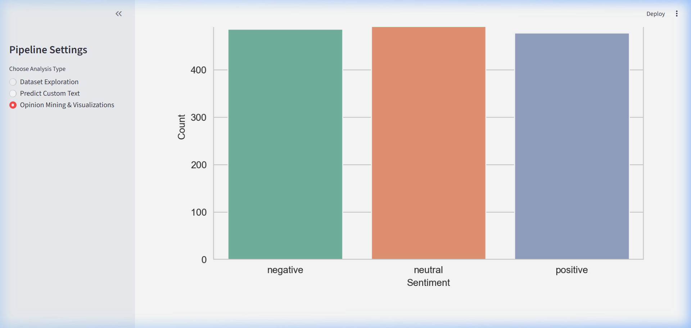

# 🗣️ Opinion Mining & Sentiment Analysis Hub

A premium **Streamlit** dashboard designed to analyze social media sentiment toward major US airlines. This application uses **Machine Learning (Logistic Regression)** and **Natural Language Processing (NLP)** to extract insights from public tweets.

---

## 🚀 Key Features

### 1. Dataset Exploration
- View raw and cleaned samples of the **Twitter US Airline Sentiment** dataset.
- Real-time model accuracy metrics (trained on synthetic data for demonstration).
- Total record count and metadata overview.

### 2. Live Sentiment Analyzer
- Input any custom tweet or comment to predict its sentiment.
- **Confidence Scores**: Dynamic progress bars showing the probability for *Positive*, *Neutral*, and *Negative* categories.
- **Premium Indicators**: Color-coded sentiment results (Green for Positive, Red for Negative).

### 3. Opinion Mining & Visualizations
- **Sentiment Distribution**: High-resolution bar charts showing the overall mood of the dataset.
- **Word Clouds**: Interactive word clouds that reveal the most prominent terms for each sentiment.
- **Brand Analysis**: Grouped bar charts breaking down sentiment scores for each major airline (Virgin America, United, Southwest, etc.).

---

## 🛠️ How it Works (Under the Hood)

### 🧩 NLP Preprocessing
The application uses a robust preprocessing pipeline:
1.  **Regex Cleaning**: Removes mentions (@user), hashtags (#), retweets (RT), and URLs.
2.  **Stopwords Removal**: Filters out common English filler words.
3.  **Lemmatization**: Uses NLTK's `WordNetLemmatizer` to reduce words to their base form (e.g., "flying" -> "fly").
4.  **Global Optimization**: To ensure maximum speed, the lemmatizer and stopwords are initialized globally instead of per-request.

### 🤖 Machine Learning Model
- **Feature Extraction**: Uses `TfidfVectorizer` with a limit of 5,000 features.
- **Algorithm**: `Logistic Regression` with a maximum of 1,000 iterations for convergence.
- **Efficiency**: Data loading and model training are cached using Streamlit's `@st.cache_data` and `@st.cache_resource`.

---

## 🎨 Premium UI/UX
- **Dynamic CSS**: Rounded containers, custom hover effects on buttons, and subtle box shadows for a modern look.
- **Modern Palette**: Uses Seaborn's `Set2` and `whitegrid` styles for professional charts.
- **Responsive Layout**: Designed with a wide layout to support multi-column metrics and large visualizations.

---

## 📦 Installation & Setup

1.  **Install Dependencies**:
    ```bash
    pip install -r requirements.txt
    ```

2.  **Generate Dataset** (Optional, if `Tweets.csv` is missing):
    ```bash
    python generate_data.py
    ```

3.  **Run the Application**:
    ```bash
    python -m streamlit run app.py
    ```

---

## 📸 Preview


